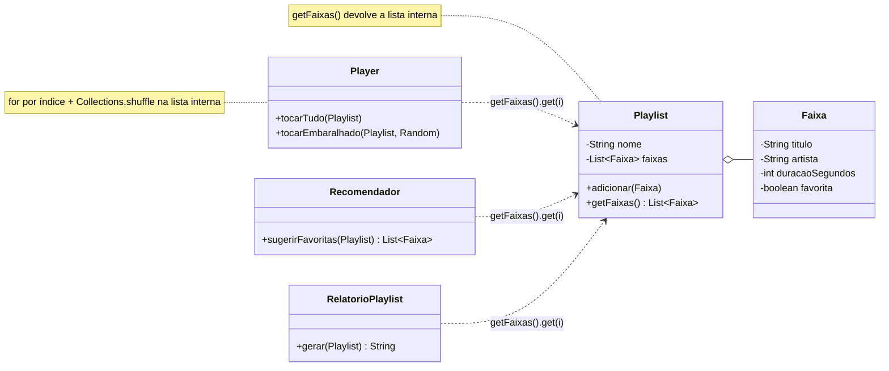
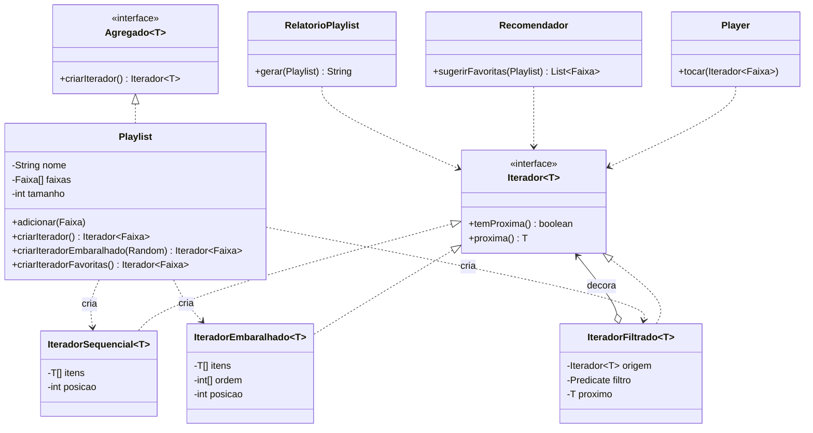

# Atividade 13 — Iterator

Projeto Maven / Java 17 com duas versões do app de música:

| Pasta | Conteúdo |
|---|---|
| [`antes/`](antes) | Versão com o anti-pattern: `getFaixas()` expõe a lista interna e cada cliente faz o próprio laço por índice |
| [`depois/`](depois) | Versão refatorada com o padrão Iterator, com testes JUnit 5 |

```bash
# antes
cd antes && mvn compile
java -cp target/classes br.venson.net.designpatterns.iterator.Main

# depois
cd depois && mvn test
java -cp target/classes br.venson.net.designpatterns.iterator.Main
```

---

## Exercício 1 — Aplicações

**1. Playlist percorrida em várias ordens (sequencial, embaralhada, só favoritas) sem expor a estrutura: faz sentido usar Iterator.**
É o caso clássico de **várias travessias** sobre o mesmo agregado. Cada ordem vira um iterador próprio, o restante do código usa só `temProxima()`/`proxima()` e a estrutura interna da coleção fica encapsulada.

**2. Explorador de arquivos percorrendo uma árvore de pastas: faz sentido usar Iterator.**
A travessia de uma árvore (em profundidade ou em largura) é não trivial e depende de como os nós estão ligados. Um iterador encapsula essa lógica, normalmente com uma pilha ou fila interna, e entrega os nós um a um, sem que a interface revele a estrutura do Composite.

**3. Leitura de arquivo gigante por partes (streaming), um registro por vez: faz sentido usar Iterator.**
O iterador permite **avaliação preguiçosa**: cada `proxima()` lê só o próximo registro, então o consumo de memória é constante, independentemente do tamanho do arquivo. O cliente não precisa saber de buffers, offsets nem do formato do arquivo (é o que `BufferedReader.lines()` e os `Scanner`s fazem).

**4. Array fixo percorrido por um único `for` dentro da própria classe dona: não faz sentido usar Iterator.**
A coleção é simples, de tamanho conhecido, não é exposta a nenhum cliente e tem uma única travessia interna. Criar interface e iterador concreto aqui seria overengineering: o `for` direto é mais claro e não há encapsulamento a proteger.

**5. Conexão de banco expondo as linhas de um `ResultSet` uma a uma: faz sentido usar Iterator.**
O `ResultSet` já é, na essência, um cursor/iterador (`next()`). Envolvê-lo num iterador de domínio (`Iterador<Cliente>`) esconde o cursor, a estrutura da tabela e o JDBC do restante do código, e mantém a leitura sob demanda, sem carregar todas as linhas na memória.

---

## Exercício 2 — Rastreando o anti-pattern

> **Observação:** o ambiente usado para preparar a entrega não conseguiu acessar `designpatterns.venson.dev` (bloqueio de rede), por isso a pasta `antes/` é uma **reconstrução fiel ao enunciado**: mesmo pacote (`br.venson.net.designpatterns.iterator`), `Playlist.getFaixas()` devolvendo a lista interna, `Player.tocarEmbaralhado` alterando a ordem e o laço por índice repetido em `Player`, `Recomendador` e `RelatorioPlaylist`.

### 1. Consequências de `getFaixas()` devolver a lista interna

- **Quebra de encapsulamento:** qualquer cliente pode chamar `add`, `remove`, `clear`, `set`, `sort` ou `shuffle` diretamente na lista, sem passar por `Playlist`. A playlist perde o controle das próprias invariantes (validações, limite de faixas, eventos de "playlist alterada" etc.).
- **Aliasing / efeitos colaterais:** todos os clientes compartilham a mesma instância, então uma alteração feita por um afeta todos os outros, como acontece no item 2.
- **Acoplamento à implementação:** o tipo de retorno `List<Faixa>` e o acesso `get(i)` amarram os clientes a uma estrutura indexável.

Clientes que passam a depender da estrutura: **`Player`** (`tocarTudo` e `tocarEmbaralhado`), **`Recomendador`** (`sugerirFavoritas`), **`RelatorioPlaylist`** (`gerar`) e o próprio **`Main`**, que imprime `getFaixas()`.

### 2. Por que a ordem original mudou depois de `tocarEmbaralhado`?

Saída do `Main` (antes):

```
Ordem original:              [Tempo Perdido, Primeiros Erros, Lanterna dos Afogados, Pro Dia Nascer Feliz, Exagerado]
Ordem depois do embaralhado: [Primeiros Erros, Lanterna dos Afogados, Pro Dia Nascer Feliz, Exagerado, Tempo Perdido]
```

`tocarEmbaralhado` chama `Collections.shuffle(playlist.getFaixas())`. Como `getFaixas()` devolve **a própria referência** da lista interna (não uma cópia), o `shuffle` reordena *in place* o estado da `Playlist`. Uma operação que deveria ser só uma **forma de leitura** ("tocar em ordem aleatória") virou uma **escrita** no agregado. Por isso o `Recomendador` e o `RelatorioPlaylist`, que rodam depois, já veem a ordem embaralhada.

### 3. E se a `Playlist` trocar a estrutura interna?

Os três clientes fazem `for (int i = 0; i < faixas.size(); i++) faixas.get(i)`. Se a playlist passar a usar:

- **array** (`Faixa[]`): `getFaixas()` muda de tipo, e `size()`/`get(i)` deixam de existir. **Quebram os 3 clientes + o `Main`**;
- **lista ligada**: compila, mas `get(i)` vira O(n) e o laço inteiro vira **O(n²)**: quebra silenciosa de desempenho em 3 pontos;
- **páginas** (carregamento sob demanda): não existe "uma lista" para devolver. Quebram os 3 clientes, e a própria assinatura de `getFaixas()` deixa de fazer sentido.

Ou seja, **no mínimo 4 pontos** (3 clientes + `Main`), além do próprio `getFaixas()`. Uma mudança que deveria ficar *dentro* de `Playlist` vaza para todo o sistema.

### 4. Refatoração com Iterator

| Papel | Classe |
|---|---|
| **Interface de iterador** | `Iterador<T>` com `temProxima()` e `proxima()` |
| **Interface de agregado** | `Agregado<T>` com `criarIterador()` |
| **Iteradores concretos (guardam a posição)** | `IteradorSequencial` (índice `posicao`), `IteradorEmbaralhado` (permutação própria de índices + `posicao`), `IteradorFiltrado` (decorador com *lookahead*) |
| **Agregado concreto** | `Playlist`: guarda as faixas num **array privado** (trocado de `List` de propósito, para provar que a estrutura ficou escondida) e cria os iteradores com `criarIterador()`, `criarIteradorEmbaralhado(Random)` e `criarIteradorFavoritas()` |
| **Clientes** | `Player.tocar(Iterador<Faixa>)`, `Recomendador`, `RelatorioPlaylist`, que só conhecem `Iterador` |

`getFaixas()` **deixou de existir**.

#### Diagrama de classes — ANTES



#### Diagrama de classes — DEPOIS



#### Código refatorado (trechos principais; o código completo está em [`depois/`](depois/src/main/java/br/venson/net/designpatterns/iterator))

```java
public interface Iterador<T> {
    boolean temProxima();
    T proxima();
}

class IteradorSequencial<T> implements Iterador<T> {
    private final T[] itens;
    private final int tamanho;
    private int posicao = 0;                         // o iterador guarda a posição

    public boolean temProxima() { return posicao < tamanho; }
    public T proxima() {
        if (!temProxima()) throw new NoSuchElementException();
        return itens[posicao++];
    }
}

public class Playlist implements Agregado<Faixa> {
    private Faixa[] faixas = new Faixa[4];           // estrutura privada
    private int tamanho = 0;

    public Iterador<Faixa> criarIterador()                       { return new IteradorSequencial<>(faixas, tamanho); }
    public Iterador<Faixa> criarIteradorEmbaralhado(Random r)    { return new IteradorEmbaralhado<>(faixas, tamanho, r); }
    public Iterador<Faixa> criarIteradorFavoritas()              { return new IteradorFiltrado<>(criarIterador(), Faixa::isFavorita); }
}

public class Player {
    public void tocar(Iterador<Faixa> faixas) {      // um único laço para qualquer ordem
        while (faixas.temProxima()) System.out.println("  > Tocando: " + faixas.proxima());
    }
}
```

### 5. Novas travessias sem duplicar laços e sem expor a estrutura

- **O laço existe uma vez só.** `Player.tocar` percorre *qualquer* `Iterador<Faixa>`. Tocar em ordem, embaralhado ou só as favoritas é só passar outro iterador: `player.tocar(playlist.criarIteradorEmbaralhado(random))`.
- **A ordem é responsabilidade do iterador, não da coleção.** `IteradorEmbaralhado` embaralha uma **permutação de índices própria** (Fisher-Yates), então a playlist nunca é alterada. Na saída do `Main` refatorado a ordem continua a mesma depois do embaralhado, e o teste `embaralhadoVisitaTodasSemAlterarAPlaylist` comprova isso.
- **Travessias se combinam.** `IteradorFiltrado` é um decorador sobre qualquer iterador. "Favoritas" é `filtro(sequencial)`, e "favoritas embaralhadas" é `filtro(embaralhado)`, sem uma linha de laço nova:
  ```java
  player.tocar(new IteradorFiltrado<>(playlist.criarIteradorEmbaralhado(new Random(7)), Faixa::isFavorita));
  ```
- **A estrutura pode mudar à vontade.** A `Playlist` refatorada já usa um array no lugar da `List` do projeto original e **nenhum cliente percebeu**. Trocar por lista ligada ou páginas exigiria mexer só na `Playlist` e nos iteradores (que são *package-private*), nunca em `Player`, `Recomendador` ou `RelatorioPlaylist`.
- **Cada iterador tem estado próprio**, então duas travessias simultâneas não interferem uma na outra (teste `iteradoresSaoIndependentes`).

---

## Justificativa das decisões de design

**`Iterador<T>` próprio com `temProxima()`/`proxima()` em vez de expor coleções.** Segue o enunciado e deixa explícito o papel de cada classe no padrão. O contrato é mínimo e não oferece nenhuma operação de escrita, então os clientes só conseguem **ler**. Isso elimina por construção o bug do `shuffle` na lista interna. `proxima()` lança `NoSuchElementException` quando não há mais elementos, o mesmo contrato do `java.util.Iterator`.

**Interface `Agregado<T>`.** Formaliza o outro lado do padrão ("quem sabe criar iteradores sobre si") e permite que outras coleções do app (álbum, fila de reprodução) sejam percorridas pelo mesmo código cliente.

**Iteradores concretos *package-private*, criados pela `Playlist`.** Só a `Playlist` conhece o array interno, e só ela pode entregá-lo aos iteradores. Os clientes recebem a interface `Iterador`, nunca a classe concreta nem a estrutura. É isso que permite trocar `List` por array, como foi feito, sem impacto externo.

**Cada iterador guarda a própria posição.** O estado da travessia (`posicao`, `ordem`) mora no iterador, e não na coleção. Por isso há várias travessias independentes e simultâneas, e a coleção continua imutável do ponto de vista de quem percorre.

**Embaralhar índices, e não a coleção.** `IteradorEmbaralhado` aplica Fisher-Yates num `int[]` próprio: O(n) em tempo e memória, distribuição uniforme e nenhum efeito colateral. O `Random` é injetado, o que torna a travessia **determinística em testes** (semente fixa) e aleatória em produção.

**`IteradorFiltrado` como decorador.** Em vez de um "iterador de favoritas" com laço próprio, um único decorador genérico com `Predicate` resolve *qualquer* filtro (favoritas, por artista, por duração) e se compõe com *qualquer* ordem. Novas travessias passam a ser combinações, não código novo duplicado.

**Testes como evidência.** `PlaylistIteradorTest` cobre a ordem sequencial (incluindo o crescimento do array além da capacidade inicial), o embaralhamento sem efeito colateral, o filtro, a independência entre iteradores e o contrato de exceção.
